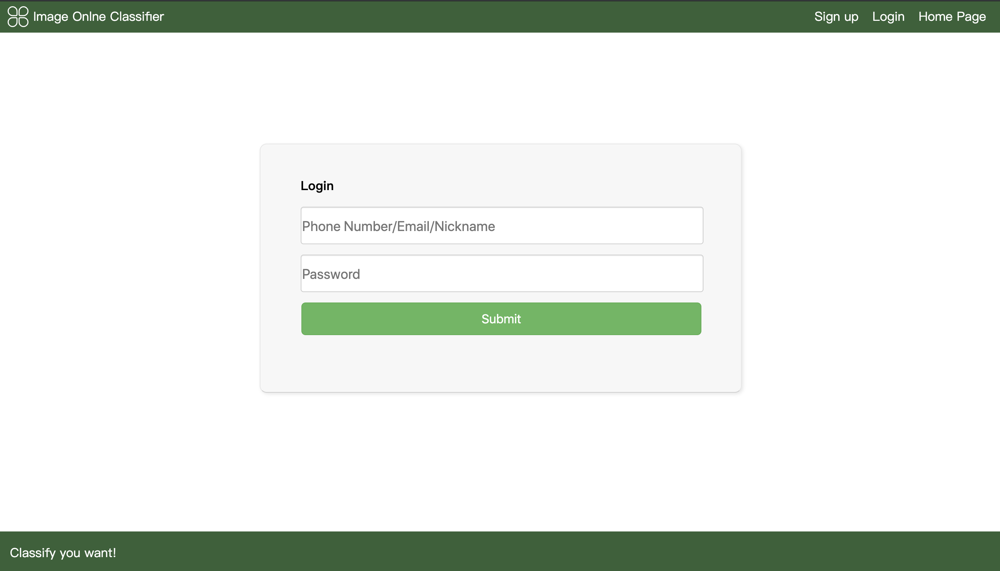
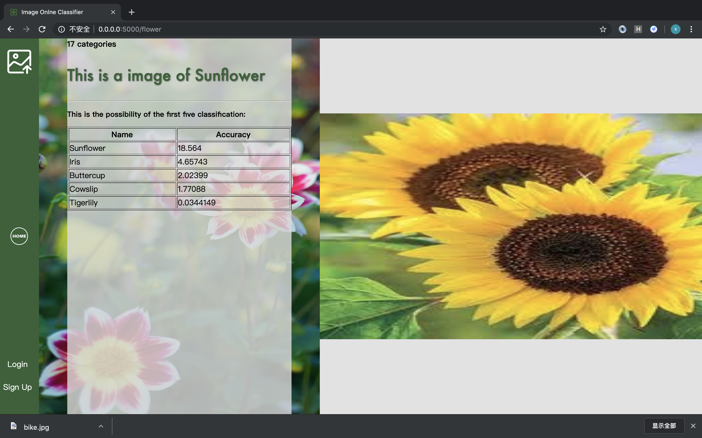
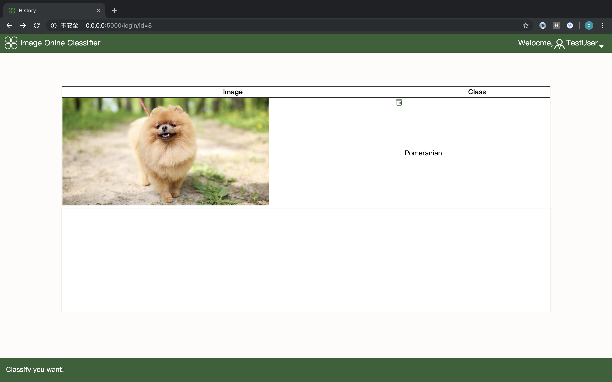

# Docker-tensorflow_serving
以Python-Flask框架为基础，使用Docker部署Tensorflow-Serving实现Web图片在线分类系统。
## 服务器端安装
一.Tensorflow-Serving子服务器  
1.使用docker拉取TF-Serving镜像或使用DockerFile构建镜像      
2.部署模型  
二.Python子服务器  
1.安装python2.7  
2.为保证系统安全，建议安装虚拟环境  
```
pip install virtualenv
```  
3.新建虚拟环境  
```
virtualenv venv
```    
4.激活虚拟环境
```
source venv/bin/activate       # Linux 下
venv\scripts\activate          # Windows 下
```  
5.在项目目录下，安装第三方需求包  
```
pip install -r requirements
```
## 运行
**项目结构如下：**
```
Appserver/
├── app
│   ├── static/      # 静态资源文件夹
│   ├── templates/   # 模板文件夹
│   ├── __init__.py  # 初始化文件
│   ├── flower.py # 花卉分类
│   ├── models.py # 数据库模型
│   ├── others.py # 1000中事物分类
│   ├── user_info.py # 用户注册
│   └── user_login.py # 用户登陆及子功能
├── config.py    # 配置文件
├── createdb.py # 创建数据库
├── run.py # 主程序文件
├── requirements     # 需求文件
└── README.md
```
1.切换到主程序目录  
```
cd Docker-tensorflow_serving/
```  
2.运行项目  
```
python run.py
```
## 实现效果
**主界面**  
  
**登陆**  
  
**花卉分类**  
  
**1000种事物分类**  
  
**历史记录**  
  
